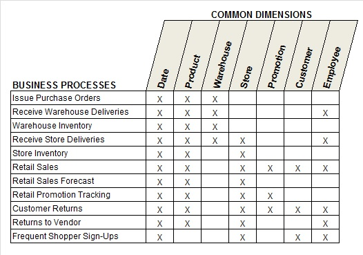

# The Matrix Revisited

現在、業界ではマスターデータ管理（MDM）が注目を集めています。このタイミングで、Kimball メソッドの最も重要な要素の一つを再考するのは適切でしょう。1999 年、Ralph Kimball は「The Matrix」というタイトルのコラムを Intelligent Enterprise 誌に寄稿しました。同名の映画はその後 2 つの続編を生みましたが、私たちはこのマトリックスについて 6 年以上もコラムで取り上げていませんでした。

ディメンショナルモデリングの目的は、情報を分かりやすく提供することです。この目的は、企業のパフォーマンス情報全体と、それに関連する参照データを表現する際にも適用されます。一見すると非常に困難な課題のように思えますが、行と列で構成されるマトリックスの形式は、この課題に非常に適しています。エンタープライズ・データウェアハウス・バス・マトリックスは、データウェアハウスやビジネスインテリジェンスの専門家にとって、まるでスイスアーミーナイフのような存在です。このツールは、アーキテクチャの計画、データ統合の調整、組織内のコミュニケーションなど、複数の目的に役立ちます。

## マトリックスの列：参照データの管理

バスマトリックスの基本を掘り下げるにあたり、まずはマトリックスの列から見ていきましょう。これらの列は、マスターデータ管理（MDM）とデータ統合の課題に直接対応します。バスマトリックスの各列は、標準化された記述参照データの自然なグループを表します。Kimball メソッドの用語では、マトリックスの列はコンフォームド・ディメンション（適用ディメンション）であり、フィルタリング、制約、グループ化、ラベリングに使用されるテキスト属性を含みます。各属性には、統一された名称、定義、ドメイン値が設定されており、一貫したデータの表示、解釈、内容を保証します。

バスマトリックスには、`誰（Who）`、`何（What）`、`どこ（Where）`、`いつ（When）`、`なぜ（Why）`、`どのように（How）` を識別するための個別列が含まれます。例えば、日付（Date）、顧客（Customer）、製品（Product）、従業員（Employee）など、各ビジネスイベントや取引活動に関連する要素が該当します。

近年、マスターデータ管理（MDM）とデータ統合の重要性について多くの議論がなされています。私たちもこの考えに全面的に賛同します。Kimball Group は、1984 年に「コンフォーム・ドディメンション」という用語を初めて使用して以来、この概念を提唱し続けてきました。他の専門家たちがこの考えを支持し始めたことを嬉しく思います。データを統合するためのフレームワークなしに、個別のデータストア（ウェアハウス、マート、キューブなど）を構築することは許されません。

再利用可能なコンフォームド・ディメンションは、データ統合の強力な接着剤となり、企業が主要な業務プロセスを横断的に分析できるようにします。

## データスチュワードシップ（データ管理の責任）

残念ながら、コンフォームド・ディメンションを自動的に作成し、組織のマスターデータ管理の問題を魔法のように解決する製品は存在しません。

エンタープライズ全体で使用されるマスターデータを定義することは、技術的な課題ではなく、文化的・組織的な課題です。技術はデータ統合を支援し、促進することはできますが、根本的な問題を解決するわけではありません。データスチュワードシップ（データ管理の責任）が、解決策の重要な要素となります。

私たちの経験では、最も効果的なデータスチュワード（データ管理者）はビジネス部門から選ばれます。データウェアハウスチームは、技術と同様に、データスチュワードシップを支援し、問題や機会を特定し、合意された決定を実装して「ゴールドスタンダード」のディメンションを作成・維持・配布する役割を担います。しかし、ビジネスの専門家こそが、異なるビジネス視点を統合し、共通の参照データを確立する役割を果たします。

この合意形成を実現するためには、経営層（ビジネスおよび IT の上級幹部）がデータスチュワードシップのプロセスとその成果を積極的に支援することが不可欠です。これは、避けられない妥協を含め、組織全体で受け入れるべきプロセスです。

長年にわたり、「コンフォームド・ディメンションの統一は難しすぎる」という批判を受けてきました。確かに、異なる部門の人々が共通の属性名、定義、値に合意するのは容易ではありません。しかし、統一された統合データを実現するためには不可欠なプロセスです。

各部門が独自のラベルやビジネスルールを主張し続ける限り、データウェアハウスが約束する「唯一の真実のバージョン」を提供することは不可能です。

## マトリックスの行：プロセス中心の視点

マトリックスの列がビジネスの「名詞」を表すのに対し、マトリックスの行は「動詞」として表現されます。

バス・マトリックスの各行は、組織内のビジネスプロセスに対応します。ビジネスプロセスとは、注文の受付、出荷、請求、支払いの受領、サービスコールの対応など、企業が実行する活動のことです。通常、これらのアクションやイベントが発生するたびに、測定値（メトリクス）が生成されます。例えば、

- 注文受付時
  - 注文数量と金額が記録される
- 出荷・請求時
  - 注文時とは異なる数量・金額が発生する
- 支払い受領時
  - 支払い金額が記録される
- サービスコール対応時
  - 通話時間などのメトリクスが記録される

各ビジネスプロセスは通常、業務システムによってサポートされますが、これが複雑さを生む要因にもなります。例えば、一部の企業では大規模な単一の業務システムが複数のビジネスプロセスをサポートしている一方で、他の企業では複数の注文管理システムが存在することもあります。マトリックスの列と行を関連付ける、数十のコアプロセスとディメンションを特定したら、マトリックスのセルを塗りつぶして、それぞれの行と列の関連性を示します。すると、組織のコンフォームドディメンションと主要なビジネスプロセスの論理的な関係が一目で分かるようになります。

データウェアハウスのバス・マトリックスの行と列の数は、組織によって異なります。多くの企業では、マトリックスはほぼ正方形に近く、25 ～ 40 行程度の行と、それに匹敵する数の列を持つことが一般的です。しかし業界によっては、興味深い例外もあります。例えば、保険業界や医療業界では、通常、列の数が行の数よりも多くなる傾向があります。

マトリックスの行と列を整理することは比較的簡単であり、この作業自体が全体的なデータアーキテクチャの定義につながります。マトリックスは、データベースや技術プラットフォームの違いに関係なく、大局的な視点を提供しつつ、適切な規模の開発プロジェクトを特定するのに役立ちます。また、個別の開発チームがマトリックスの各コンポーネントを比較的独立して作業できるため、最終的にすべてのピースが適切に組み合わさることが保証されます。

さらに、マトリックスは簡潔で効果的なコミュニケーションツールとしても機能します。開発チーム内外で計画を視覚的に伝えるだけでなく、IT 部門やビジネス部門の上級管理職にも直接説明することができます。ただし、マトリックスは一度作成したら放置する静的なドキュメントではありません。ビジネス要件の詳細を掘り下げ、運用システムの現実を理解するにつれて、マトリックスも進化していくべきものです。

## よくあるマトリックスの失敗例

バスマトリックスを作成する際、各列や行の詳細レベルをどの程度にするかで悩むことがあります。 特に、行の定義に関する誤りは、以下の 2 つのパターンに分類されます。

### 部門単位または広すぎる行

マトリックスの行を、企業の組織図のボックス（部門や機能グループ）に対応させるべきではありません。組織図はビジネスプロセスではなく、機能グループを表しているためです。確かに、一部の部門は特定のビジネスプロセスに深く関与しているかもしれませんが、マトリックスの行が CEO の直属の部下リストのようになってしまうのは避けるべきです。

### レポート中心または狭すぎる行

逆に、マトリックスの行が単なるレポートのリストのようになってしまうのも問題です。例えば、「出荷注文（Shipping Orders）」というビジネスプロセスは、顧客ランキング、営業担当者のパフォーマンス分析、製品の動向分析など、さまざまな分析をサポートします。 しかしながら、マトリックスの行はビジネスプロセスを表すべきであり、そこから派生するレポートや分析を直接リストアップするべきではありません。

## マトリックスの列の定義に関する誤り

マトリックスの列を定義する際にも、過度に広すぎる定義や狭すぎる定義の落とし穴があります。

### 過度に一般化された列

例えば、「人物（Person）」という列を作成すると、社内の従業員、外部のサプライヤー、顧客の担当者など、さまざまな種類の人々が含まれることになります。しかし、これらのグループはほとんど重複しないため、1 つの汎用的なディメンションにまとめると混乱を招く可能性があります。 同様に、「所在地（Location）」という列に、企業施設の住所、従業員の住所、顧客の所在地をすべて含めるのも適切ではありません。

### 階層の各レベルを個別の列にする

マトリックスの列は、ディメンションの最も詳細なレベルを表すべきです。例えば、売上予測のメトリクスがブランドレベルで必要な場合があるかもしれません。しかし、「製品（Product）」「ブランド（Brand）」「カテゴリ（Category）」「部門（Department）」といった各階層を個別の列として作成するのは避けるべきです。代わりに、「製品（Product）」という 1 つの列を作成し、セルを塗りつぶす際に、どのレベルの詳細が必要かを示すのが適切です。

さらに極端な例として、各属性を個別の列としてリストアップすることもありますが、これはディメンションの概念を無視し、管理不能なマトリックスを生み出すことになります。

## マトリックスの拡張

バスマトリックスの大きな利点の一つは、そのシンプルさです。この表形式のフォーマットは、データウェアハウス/ビジネスインテリジェンス（DW/BI）の他の「関係性」を表現するためにも再利用できます。これらの拡張は、エンタープライズ DW バスマトリックスの代替ではなく、補完的な活用方法として考えるべきです。

### オポチュニティマトリックス

バスマトリックスの行が確定したら、ディメンションの列を「ビジネスのステークホルダー（マーケティング、営業、財務など）」に置き換えます。ビジネス要件の収集活動を基に、どのステークホルダー（列）が、どのビジネスプロセス（行）に関心を持っているかを示すためにセルを塗りつぶします。このマトリックスは、行の優先順位を決定するのに役立つだけでなく、どのビジネスグループがディメンショナルモデリングの共同セッションに参加すべきかを明確にするのにも役立ちます。

### 詳細な実装バスマトリックス

単一のビジネスプロセスの行が、複数のファクトテーブルや OLAP キューブを生み出すことがあります。例えば、詳細レベルと集約レベルの両方でメトリクスを表示する必要がある場合や、トランザクションデータとスナップショットデータの両方を扱う場合などです。このような場合、マトリックスの行を拡張し、個々のファクトテーブルや OLAP キューブをリストアップし、それぞれの粒度や取得・派生メトリクスを明示します。ただし、標準的なバスマトリックスのディメンション列はそのまま維持します。

バスマトリックスは、データウェアハウスの設計、データ統合の調整、組織内のコミュニケーションにおいて、非常に強力なツールです。適切に設計し、拡張することで、より効果的なデータ管理とビジネスインテリジェンスの実現が可能になります。

[The Matrix: Revisited](https://www.kimballgroup.com/2005/12/the-matrix-revisited/)
