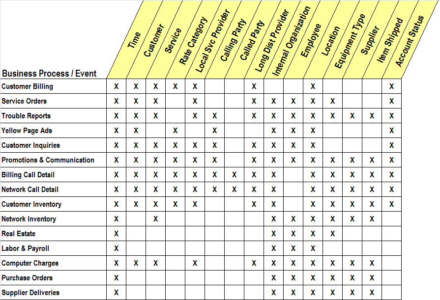

# The Matrix

長年にわたり、データウェアハウスの計画を行う際に、マトリックス形式で表現する方法が非常に有効であることを実感してきました。これは、ビジネス要件を収集し、データの調査を実施した後に、特に役立つ計画ツールです。このマトリックス手法は、中央集約型ではない分散型データウェアハウスにおいて特に効果的です。近年、私たちが構築しようとしている Web 指向で複数組織にまたがるデータウェアハウスの多くは中央の管理ポイントを持たないため、これらを計画する方法を見つけることがますます重要になっています。

このマトリックスは、縦軸にデータマートのリスト、横軸にディメンションのリストを配置したシンプルな構造です。図 1 は、大手通信会社のエンタープライズデータウェアハウスのマトリックスの例です。マトリックスを作成する際には、今後 3 年間で企業全体にわたって構築可能なすべての第一レベルのデータマートをリストアップすることから始めます。第一レベルのデータマートとは、通常以下のような特徴を持つ、関連するファクトテーブルとディメンションテーブルの集合です。

- 単一のデータソースから派生している
- 単一の部門によってサポート・実装される
- 可能な限り最も詳細なデータをソースから収集している
- 「データウェアハウス・バス」に準拠している

第一レベルのデータマートは、エンタープライズデータウェアハウスの最初の実装として、最小規模かつリスクの少ない形であるべきです。これらは、最終的なデータウェアハウスの完成に向けた基盤を形成し、短期間での実装が可能でありながら、互換性のないサイロ（独立したシステム）になることなく、最終的な成果に貢献することが保証されます。

第一レベルのデータマートは、単一の本番データソースに基づくことで、実装リスクを可能な限り低減するべきです。私の経験では、「適切な」データを選定した後のデータウェアハウスの実装コストと複雑さは、抽出すべきデータソースの数に比例します。各データソースの統合には、最大で 6 か月のプログラミングとテストが必要になることもあります。レガシーソースからデータステージングエリアを経由し、データウェアハウスのプレゼンテーション層にあるファクトテーブルやディメンションテーブルへとデータを流すための本番データパイプラインを構築する必要があります。

図 1 では、この通信会社の第一レベルのデータマートとして、多くの主要な本番データソースが挙げられています。最も明白な本番データソースの一つが、顧客請求システムであり、マトリックスの最初の行にリストされています。この行は、このデータマート内で構築する予定のすべての基本的なファクトテーブルを表しています。このデータマートには、主要な基本ファクトテーブルが 1 つ含まれ、その粒度は顧客の請求書に記載される個々の明細行であると仮定します。この明細行は、提供されたサービスのクラスを表し、サービスクラス内の個々の通話を表すものではないとします。これらの前提のもと、このファクトテーブルに必要なディメンションをチェックしていきます。顧客請求データには、時間（Time）、顧客（Customer）、サービス（Service）、料金カテゴリ（Rate Category）、地域サービスプロバイダー（Local Service Provider）、長距離プロバイダー（Long Distance Provider）、所在地（Location）、アカウントステータス（Account Status）といったディメンションが必要になります。

このように、今後 3 年間で開発可能なすべての第一レベルのデータマートを、既存のデータソースに基づいてリストアップし、マトリックスの行を作成していきます。時折、まだ存在しない本番システムに基づく第一レベルのデータマートを含めるよう求められることがありますが、私は通常これを断ります。具体的な設計・実装計画がない限り、「潜在的な」データソースを含めることは避けるようにしています。また、理想主義的すぎるデータソースの一例として、企業全体のデータモデルが挙げられます。これは通常、IT 部門の壁一面を占めるほどの規模ですが、その大部分は実際のデータソースとして利用できません。企業のデータアーキテクトに依頼し、現在実際にデータが格納されているテーブルを赤ペンでマークしてもらうとよいでしょう。赤くマークされたテーブルは、計画マトリックスにおいてデータマートの正当なデータソースとして使用できます。

マトリックスの列には、データマートが必要とする可能性のあるすべてのディメンションが示されます。実際のエンタープライズデータウェアハウスには、図 1 に示されているよりも多くのディメンションが含まれます。マトリックスを埋める前に、包括的なディメンションのリストを作成することが有益な場合もあります。最初に多くのディメンションをリストアップすると、各ディメンションが特定のデータマートと関連付けられる可能性があるかどうかを検討する創造的な作業が生まれます。この作業を通じて、既存のファクトテーブルに新たなディメンションデータソースを追加する興味深い方法が見つかることもあります。図 1 の詳細を検討することで、さらに多くの「X」を埋めるべきだと判断したり、重要なディメンションを追加すべきだと考えたりするかもしれません。それは素晴らしいことです！ まさにマトリックスを本来の目的通りに活用している証拠です。

## データマートグループをコンフォーミング・ミーティングに招待する

マトリックスの行を横に見渡すと、多くのことが明らかになります。各データマートの全体的なディメンション構成を一目で把握でき、ディメンションを含めるべきか除外すべきかを検討することができます。しかし、マトリックスの真の力は、列を見たときに発揮されます。マトリックスの列は、特定のディメンションがどのデータマートで必要とされるかを示すマップのようなものです。

最初のディメンションである「時間（Time）」は、すべてのデータマートで必要とされます。すべてのデータマートは時系列データを扱うためです。しかし、「時間」ディメンションでさえ慎重に検討する必要があります。あるディメンションが複数のデータマートで使用される場合、それは適用されなければなりません。適用されたディメンションは、分散型データウェアハウスの基盤となり、データマートが互換性のないサイロ（独立したシステム）になるのを防ぐ役割を果たします。ディメンションが適用されているとは、2 つのディメンションが完全に同一（キーの値やすべての属性を含む）であるか、一方がもう一方の完全なサブセットである場合を指します。したがって、すべてのデータマートで「時間」ディメンションを使用するということは、データマートチームが企業共通のカレンダーに合意することを意味します。すべてのデータマートチームは、このカレンダーを使用し、会計期間、祝日、営業日について共通の認識を持たなければなりません。

適用された「時間」ディメンションの粒度も一貫性を持たせる必要があります。データマート間で異なる週や月の定義を無秩序に使用すると、互換性のないデータマートが生まれる原因となります。例えば、「4 週間単位」や「4-4-5 週間の四半期」などの不自然な時間単位は避けるべきです。

図 1 の 2 番目のディメンションである「顧客（Customer）」は、「時間」よりもさらに興味深いものです。企業全体の異なるデータソースを統合する際に、「顧客」の標準的な定義を確立することは、最も重要なステップの一つです。企業がエンタープライズデータウェアハウスを構築しようとする場合、「顧客」の共通定義を求める姿勢があるかどうかは、その組織の本気度を測るリトマス試験となります。大まかに言えば、組織がすべてのデータマートで共通の「顧客」定義に合意できない場合、その組織はデータマートを統合したデータウェアハウスを構築すべきではありません。その場合、データマートは永遠に別々のままであるべきです。

このような理由から、マトリックスの列は「コンフォーミング・ミーティング」への招待リストと考えることができます。`マトリックスは、データマートとディメンションの相互関係を明らかにする` のです。

## 上層部とのコミュニケーション

マトリックス計画は、`経営層とのコミュニケーションツール` としても優れています。その構造はシンプルで分かりやすく、データウェアハウスの技術的な詳細を知らない経営幹部であっても、マトリックスを見れば「カレンダー」「顧客」「製品」などの標準定義を確立しなければ、企業全体でデータを活用できないことが理解できます。

ディメンションを適用するための会議は、技術的な議論というよりも政治的な議論になることが多いでしょう。データウェアハウスのプロジェクトリーダーが単独で「顧客」ディメンションの統一を推進する必要はありません。企業の CIO（最高情報責任者）などの上級管理職がコンフォーミング・ミーティングに参加し、ディメンションの統一がいかに重要であるかを明確に伝えるべきです。このような政治的な支援は非常に重要です。これにより、データウェアハウスのプロジェクトマネージャーが単独で責任を負うのではなく、意思決定の負担が本来あるべき経営層に移ることになります。

## 第二レベルのデータマート

企業内の主要なデータソースをすべて第一レベルのデータマートで表現した後、第二レベルのデータマートを定義することができます。`第二レベルのデータマートは、2 つ以上の第一レベルのデータマート`を組み合わせたものです。多くの場合、第二レベルのデータマートは単なるデータセットの結合以上のものになります。

例えば、収益性分析（Profitability）データマートは、第一レベルのコスト関連データマートからのコストデータを、第一レベルの売上データマートに含まれる製品や顧客データと結びつける複雑な配分プロセスを経て作成されることがあります。このような収益性データマートの作成に関する課題については、私のコラム「Not so Fast」で詳しく説明しました。

## マトリックス計画手法の価値

マトリックス計画手法は、特に分散型データウェアハウスを構築する際に非常に役立ちます。データウェアハウスが、広範囲に分散したデータマートの集合体である場合、このマトリックスは以下の 3 つの役割を果たします。

- 技術的ツール
  - データマートとディメンションの関係を明確にする
- プロジェクト管理ツール
  - データウェアハウスの計画と進捗を整理する
- 経営層とのコミュニケーションツール
  - データの標準化の必要性を伝える

このように、マトリックスは単なる技術的な計画ツールではなく、データウェアハウスの成功を左右する重要な要素となるのです。

[The Matrix](https://www.kimballgroup.com/1999/12/the-matrix/)
