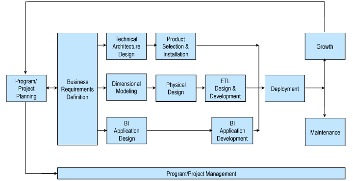

# Kimball DW/BI Lifecycle Methodology

Kimball ライフサイクル手法は、1980 年代半ばに Kimball Group のメンバーや、意思決定支援の先駆的企業である Metaphor Computer Systems の同僚によって考案されました。それ以来この手法は、ほぼすべての業界、アプリケーション領域、業務機能、技術プラットフォームにおいて、何千ものデータウェアハウスおよびビジネスインテリジェンス（DW/BI）プロジェクトチームによって成功裏に活用されてきました。

当初、この手法は「ビジネス・ディメンショナル・ライフサイクル・アプローチ」と呼ばれており、その名称は以下のような本手法の基本原則を強調していました。

- 企業全体にわたってビジネス価値を提供することに重点を置く
- ビジネスに提供されるデータをディメンショナルに構造化する
- 「ビッグバン」的な一括導入ではなく、管理可能なライフサイクル単位で DW/BI 環境を反復的に開発する

このアプローチが 1990 年代に初めて公表された当時、他の手法の多くは Kimball の原則を重視していませんでした。しかし、それ以降、これらの原則は広く採用され、業界の主流となるベストプラクティスへと発展しました。

Kimball ライフサイクル手法は、以下の図で示されるように、成功する DW/BI プロジェクトに必要な主要なタスクの順序を示す全体的なロードマップを提供します。

組織ごとに DW/BI の具体的な目標は異なるかもしれませんが、私たちは、DW/BI の成果物がビジネスの意思決定を支援するために受け入れられることが、チーム全体の最重要目標であるべきだと考えています。この目標は、DW/BI システムの設計、開発、導入のすべての段階において常に念頭に置かれるべきです。

[Design Tip #115 Kimball Lifecycle in a Nutshell](https://www.kimballgroup.com/2009/08/design-tip-115-kimball-lifecycle-in-a-nutshell/) では、Kimball 手法の概要を紹介しています。詳細については、[The Data Warehouse Lifecycle Toolkit, Second Edition](https://www.kimballgroup.com/data-warehouse-business-intelligence-resources/books/data-warehouse-dw-lifecycle-toolkit/) をご参照ください。

[Kimball DW/BI Lifecycle Methodology](https://www.kimballgroup.com/data-warehouse-business-intelligence-resources/kimball-techniques/dw-bi-lifecycle-method/)
