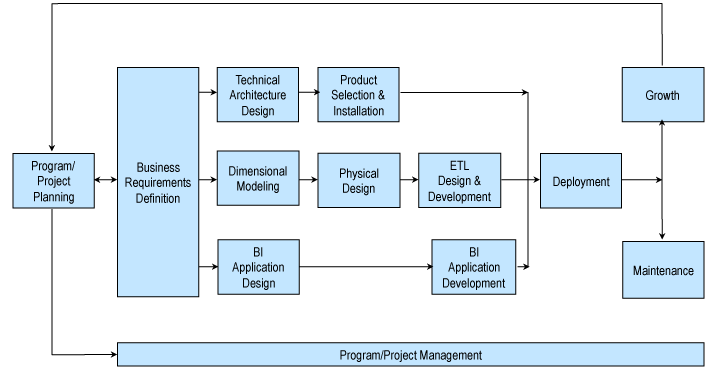

# Design Tip #115 Kimball Lifecycle in a Nutshell

最近開催された「Data Warehouse Lifecycle in Depth」クラスで、ある受講生から「Kimball ライフサイクル手法の概要をマネージャーと共有したい」との要望がありました。私は、すでにエグゼクティブ向けの要約を公開していると確信していたため、喜んで対応しました。しかし驚いたことに、私たちが公開していたライフサイクルの概要は、Toolkit シリーズの書籍の中の 1 章のみでした。そこでこの Design Tip では、私たちのアーカイブに存在していなかったこの内容の空白を埋めることにしました。

Kimball ライフサイクル手法は、数十年にわたって存在しています。その概念は、1980 年代に Kimball Group のメンバーと、Metaphor Computer Systems の数名の同僚によって考案されました。1998 年に『The Data Warehouse Lifecycle Toolkit』でこの手法を初めて発表した際には、「ビジネス・ディメンショナル・ライフサイクル」と呼んでいました。この名称は、以下の 3 つの基本概念を強調するものでした。

- 企業全体にわたってビジネス価値を提供することに重点を置く
- レポートやクエリを通じてビジネスに提供されるデータをディメンショナルに構造化する
- 「ビッグバン」的な一括導入ではなく、管理可能なライフサイクル単位でソリューションを反復的に開発する

1990 年代に遡ると、当時この一連の基本原則を強調していた手法はほとんどなく、「ビジネス・ディメンショナル・ライフサイクル」という名称は、業界内の他の手法と差別化する役割を果たしていました。しかし、2008 年に『The Data Warehouse Lifecycle Toolkit（第 2 版）』を出版した際には、業界が進化し、私たちの原則が主流のベストプラクティスとして広く認識されるようになっていました。そのため、手法の正式名称を「Kimball ライフサイクル」に簡略化しました。

この数十年間で技術や理解は劇的に進化しましたが、Kimball ライフサイクルの基本構造は驚くほど一貫しています。私たちの DW/BI ソリューションの設計、開発、導入に関するアプローチは、実績のある確立された手法です。ほぼすべての業界、アプリケーション領域、業務機能、技術プラットフォームにおいて、何千ものプロジェクトチームがこの手法を活用してきました。Kimball ライフサイクル手法は、何度も成功を証明してきたのです。

図 1 に示されるように、Kimball ライフサイクル手法において、成功する DW/BI の実装には多くのタスクやコンポーネントを適切に統合することが不可欠です。完璧なデータモデルや最先端の技術を持っているだけでは不十分です。ライフサイクルの図は、効果的な設計、開発、導入に必要なタスクの順序を示す全体的なロードマップとなっています。

## プログラム／プロジェクトの計画と管理

ロードマップの最初のボックスは、プログラム／プロジェクトの立ち上げに焦点を当てており、スコープの定義、正当性の確保、スタッフの配置などが含まれます。ライフサイクル全体を通じて、継続的なプログラムおよびプロジェクト管理のタスクが、活動を軌道に乗せる役割を果たします。

## ビジネス要件

Kimball ライフサイクルにおいて、ビジネス要件の収集は重要なタスクです。なぜなら、これらの要件が、上流および下流のほとんどの意思決定を左右するからです。要件を収集する際には、「データウェアハウスに何が欲しいか？」と尋ねるのではなく、「現在ビジネスユーザーが行っていること（または将来的に行いたいこと）」に焦点を当てます。企業全体の主要な機会を特定し、ビジネス価値と実現可能性に基づいて優先順位を付けた後、DW/BI システム開発の最初のイテレーションに向けた詳細な要件を収集します。ビジネス要件の定義が完了すると、3 つの並行するライフサイクルトラックが開始されます。

## テクノロジートラック

DW/BI 環境では、多くの技術、データストア、および関連するメタデータを統合する必要があります。テクノロジートラックは、必要な機能のリストを作成するシステムアーキテクチャ設計から始まり、その後、アーキテクチャ要件を満たす製品の選定と導入が行われます。

## データトラック

データトラックは、ビジネス要件を満たすターゲットディメンショナルモデルの設計から始まります。この際、基盤となるデータの現実的な制約も考慮します。「Kimball」といえばディメンショナルモデリングであり、データは測定値（ファクト）と記述的な属性（ディメンション）に分類されます。ディメンショナルモデルは、リレーショナルデータベース（スター・スキーマ）や多次元データベース（OLAP キューブ）に実装できます。どのプラットフォームであっても、ディメンショナルモデルは「ユーザーにとっての使いやすさ」と「高速なクエリ性能」という 2 つの目標を同時に達成することを目指します。

エンタープライズ・データウェアハウス・バスマトリックス は、Kimball ライフサイクルの重要な成果物であり、組織の主要なビジネスプロセスと、それに関連する共通の整合ディメンションを表します。これは、トップダウンの企業統合を確保しつつ、ボトムアップで管理可能な単位での導入を実現するためのデータ設計図です。

ディメンショナルモデルは物理設計に変換され、パフォーマンスチューニング戦略が考慮されます。その後、ETL システムの設計と開発が行われます。ライフサイクルでは、ETL プロセスを 4 つの主要な操作に分類し、34 のサブシステムを定義しています。

## ビジネスインテリジェンストラック

一部のプロジェクトメンバーが技術やデータに集中する一方で、他のメンバーは、標準レポート、パラメータ化クエリ、ダッシュボード、スコアカード、分析モデル、データマイニングアプリケーションなど、幅広い BI アプリケーションの特定と構築に取り組みます。

## 導入、保守、成長

3 つのライフサイクルトラックは導入フェーズで統合され、テクノロジー、データ、BI アプリケーションが結びつきます。導入後は保守フェーズに入り、次のイテレーションに向けた成長が、プロジェクト計画へとフィードバックされます。DW/BI システムは一度限りのプロジェクトではなく、長期的なプロセスであることを忘れてはなりません。

最後に、どのような DW/BI 目標を持つ組織であっても、最も重要な目標は「ビジネスが DW/BI の成果物を受け入れ、意思決定を支援すること」であるべきです。この目標は、設計、開発、導入のすべての段階で常に最優先されるべきです。

[Design Tip #115 Kimball Lifecycle in a Nutshell](https://www.kimballgroup.com/2009/08/design-tip-115-kimball-lifecycle-in-a-nutshell/)
