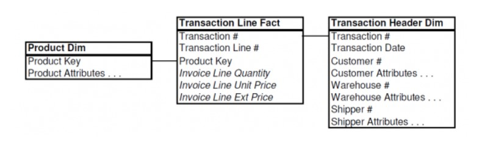
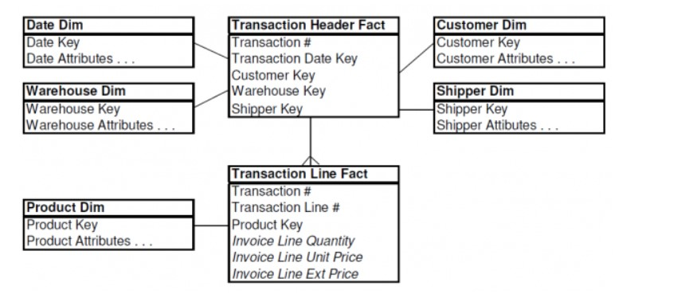
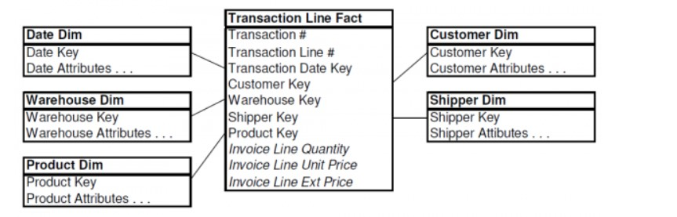

# Design Tip #95 Patterns to Avoid when Modeling Header/Line Item Transactions

多くのトランザクション処理システムでは、「ヘッダー（親）」と「明細（子）」の関係を持つデータ構造が採用されています。業界を問わず、このような構造を持つ業務システムが組織内に存在するはずです。しかし、データウェアハウス（DW）やビジネスインテリジェンス（BI）向けにこのデータをモデリングする際、多くの設計者が業務システムのヘッダー/明細の構造をそのままディメンショナルモデルに再現してしまうことがあります。

本稿では、請求データ（Invoicing Data）をケーススタディとして、2 つの一般的だが誤った設計アプローチを紹介し、最適な設計方法を提案します。誤った設計を視覚化することで、自身のスキーマに潜む類似の問題を特定しやすくなるでしょう。

## 誤った設計 #1: ヘッダーをディメンションとして扱う

このアプローチでは、業務システムのトランザクションヘッダーを、そのままディメンションテーブルとして再現します。

- トランザクションヘッダーディメンションには、業務システムのヘッダーデータがすべて格納される。
- このディメンションの主キー（ナチュラルキー）は、トランザクション番号（Transaction Number）。
- ファクトテーブルの粒度は「1 行 = 1 つの明細行（Line Item）」。
- ファクトテーブルには、ほとんどディメンションキーが含まれず、説明的な情報はすべてヘッダーディメンションに埋め込まれる。

### この設計の問題点

✅ ヘッダーディメンションが非常に大きくなる

- 例えば、1 つのトランザクションに平均 5 つの明細行がある場合、ヘッダーディメンションのサイズはファクトテーブルの 20%にも達する。
- 通常、ファクトテーブルとディメンションテーブルのサイズには桁違いの差があるべきだが、この設計ではそれが崩れる。

✅ ディメンションの成長速度が異常に速い

- 通常、ディメンションテーブルはファクトテーブルほど急速に成長しない。
- しかし、この設計では、新しいトランザクションが発生するたびに、ヘッダーディメンションに 1 行、ファクトテーブルに平均 5 行が追加される。

✅ 分析の際に非効率な結合が必要になる

- 例えば、「顧客」「倉庫」「配送業者」などの情報を使って分析する場合、巨大なヘッダーディメンションを経由しなければならず、クエリのパフォーマンスが低下する。

## 誤った設計 #2: ヘッダーをファクトテーブルとして扱う

このアプローチでは、トランザクションヘッダーをディメンションではなく、ファクトテーブルとして扱う。

- ヘッダーに関連する説明的な情報は、個別のディメンションテーブルに分割。
- ヘッダーファクトテーブルと明細ファクトテーブルは、トランザクション番号（Transaction Number）で結合。
- 明細ファクトテーブルの構造と粒度は、誤った設計 #1 と同じ。

### この設計の問題点

✅ ヘッダーファクトテーブルと明細ファクトテーブルの結合が必要になる

- ユーザーが明細データをヘッダーの属性で分析したい場合、巨大なヘッダーファクトテーブルと、さらに大きな明細ファクトテーブルを結合しなければならない。
- これにより、クエリのパフォーマンスが大幅に低下する。

✅ ヘッダーと明細の関係を維持するための結合が複雑になる

- 例えば、「特定の支払い方法を使用した注文の売上を分析する」場合、ヘッダーファクトテーブルと明細ファクトテーブルを結合し、さらに支払い方法ディメンションを参照する必要がある。
- これにより、クエリの記述が複雑になり、パフォーマンスも悪化する。

## 推奨される設計: ヘッダーのディメンション情報を明細レベルに持ち込む

最適な設計では、業務システムの「トランザクションヘッダー」という概念を捨て、ヘッダーのディメンション情報を明細レベルに持ち込む。

### 設計のポイント

✅ ヘッダーの属性を、明細ファクトテーブルに直接含める

- 例えば、「顧客」「倉庫」「配送業者」などの情報を、明細ファクトテーブルのディメンションキーとして格納する。
- これにより、明細データを直接フィルタリングでき、ヘッダーファクトテーブルとの結合が不要になる。

✅ トランザクション番号は退化ディメンション（Degenerate Dimension, DD）として扱う

- トランザクション番号（Transaction Number）は、ファクトテーブル内に直接格納し、ディメンションテーブルを持たない。
- これにより、トランザクション単位での集計や分析が容易になる。

## この設計のメリット

✅ クエリのパフォーマンスが向上

- ユーザーが「顧客」「倉庫」「配送業者」などの属性で明細データを分析する際、ヘッダーファクトテーブルとの結合が不要になる。

✅ データの一貫性が向上

- ヘッダーの情報が明細レベルに統合されるため、データの整合性が保たれ、分析が容易になる。

✅ ファクトテーブルの粒度が明確になる

- 1 行 = 1 つの明細行という明確な粒度を維持できる。

## 結論

- ヘッダーをディメンションとして扱うのは NG（サイズが大きくなりすぎる）
- ヘッダーをファクトテーブルとして扱うのも NG（結合が複雑になりすぎる）
- 最適な設計は、ヘッダーの属性を明細レベルに持ち込み、トランザクション番号を退化ディメンションとして扱うこと

この設計を採用することで、パフォーマンスの向上、データの一貫性の確保、クエリの簡素化が実現できます！ 🚀

[Design Tip #95 Patterns to Avoid when Modeling Header/Line Item Transactions](https://www.kimballgroup.com/2007/10/design-tip-95-patterns-to-avoid-when-modeling-headerline-item-transactions/)
